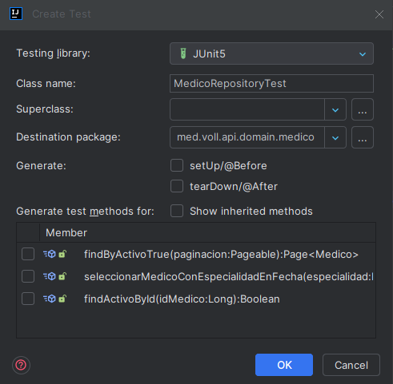
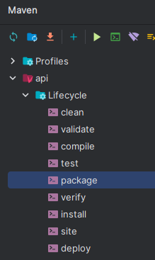

## Curso: Spring Boot 3: documentar, probar y preparar una API para su implementación
### Instructor: Jose Viera Flores https://www.linkedin.com/in/jose-viera-flores-99680975/
### Academia: Alura Latam
### Programa: One Next Oracle Education G6: 2024

| Clase | Descripción                                                                                                   | Observaciones           |
|-------|---------------------------------------------------------------------------------------------------------------|-------------------------|
| 01-04 | Nueva funcionalidad                                                                                           |                         |
|       | se deifinen las nuevas opciones para agendar nueva cita                                                       |                         |
|       | se definen las reglas de negocio                                                                              |                         |
|       |                                                                                                               |                         |
| 01-05 | Consulta controller                                                                                           |                         |
|       | Se crea la clase consultacontroller con las siguientes anotaciones:                                           |                         |
|       | @Component, @ResponseBody, @RequestMapping("/consultas")                                                      |                         |
|       | se crea el dto DatosAgendarConsulta                                                                           |                         |
|       | se crea el dto DatosDetalleConsulta                                                                           |                         |
|       | se crea la entidad Consulta                                                                                   |                         |
|       | se agregan los dto para pacientes                                                                             |                         |
|       | se agregan las migraciones de crear tabla pacientes y tabla consultas                                         |                         |
|       |                                                                                                               |                         |
| 01-08 | Clase Service                                                                                                 |                         |
|       | se revisan las validaciones basandose en las reglas del negocio                                               |                         |
|       | se corrige errores,                                                                                           |                         |
|       | 1. consultacontroller debia ser marcada con @controller y no con @component                                   |                         |
|       | 2. el payload para agregar la consulta era con guiones 2024-10-10                                             |                         |
|       | se crea el service agendadeconsultaservice                                                                    |                         |
|       | - se debe respetar el principio de responsabilidad unica                                                      |                         |
|       | se separan las las reposnabilidades de cada clase                                                             |                         |
|       | se crea el repositorio                                                                                        |                         |
|       |                                                                                                               |                         |
| 01-09 | Validaciones de integridad                                                                                    |                         |
|       | se crea la excepcion validaciondeintegridad                                                                   |                         |
|       | tambien el metodo seleccionar medico.                                                                         |                         |
|       |                                                                                                               |                         |
| 01-11 | Selección medico aleatorio                                                                                    |                         |
|       | crear la validaciones con @query                                                                              |                         |
|       |                                                                                                               |                         |
| 02-02 | Clases de validación                                                                                          |                         |
|       | se crea el paquete validaciones en consulta                                                                   |                         |
|       | se crea la clase HorarioDeFuncionamientoClinica para validar horario                                          |                         |
|       | se crea la clase HorarioDeAnticipacion para validar 1/2 hora antes                                            |                         |
|       | se crea la clase PacienteActivo                                                                               |                         |
|       |                                                                                                               |                         |
| 02-03 | Validación                                                                                                    |                         |
|       | se crea el metodo en PacienteRepository   findActivoById()                                                    |                         |
|       | se crea la validacion PacienteSinConsulta asi como la PacienteActivo                                          |                         |
|       | tambien MedicoConConsulta, pacientesinconsulta, medicoactivo                                                  |                         |
|       |                                                                                                               |                         |
| 02-04 | Aplicando principios SOLID                                                                                    |                         |
|       | como las validaciones tienen metodos y firmas muy similares entonces                                          |                         |
|       | se recomienda usar interfaces, se crea ValidadorDeConsultas                                                   |                         |
|       | se definen metodos sin cuerpo, y se implementa la interface en todos las validaciones                         |                         |
|       | de esa manera se aplica el pilar de polimorfismo                                                              |                         |
|       | se agregan las anotaciones @Component y @Autowired                                                            |                         |
|       | y todas se agregan con List<ValidadorDeConsultas> validadores                                                 |                         |
|       | luego aplicando la s de solid se llama: validadores.forEach(validador -> validador.validar(datos));           |                         |
|       |                                                                                                               |                         |
| 02-06 | Testando la agenda                                                                                            |                         |
|       | se procede a ejecutar el programa para revisar errores                                                        |  |
|       |                                                                                                               |  |
| 03-02 | Documentando con SpringDoc                                                                                    |                         |
|       | se usa openAPI openapi.org en springdoc.org                                                                   |                         |
|       | se agrega la dependencia y se habilita en securityconfiguration                                               |                         |
|       | para ver el json que genera la dependencia springdoc se puede usar una extension en el navegagor              |                         |
|       | por ejemplo json beatiful o JSON Formater                                                                     |                         |
|       | en el link de swagger:                                                                                        |                         |
|       | **http://server:port/context-path/swagger-ui.html**                                                           |                         |
|       | **http://server:port/context-path/v3/api-docs**                                                               |                         |
|       | en el docs se muestra u json con los datos, endpoints etc                                                     |                         |
|       | el swagger es como un insomia o postman incrustado en la misma aplicacion                                     |                         |
|       |                                                                                                               |                         |
| 03-04 | JWT en la documentación                                                                                       |                         |
|       | para habilitar la autenticacion en la documentacion, dice la doc de spring  que a los metodos                 |                         |
|       | se les debe dejar anotacion @Bean y definir la operacion de seguridad @OperationSecurity                      |                         |
|       | en infra se debe crear el paquete springdoc, y dentro la clase SpringDocConfiguracion                         |                         |
|       | alli se crea el metodo openAPI, esa clase debe ser marcada con @Configuration                                 |                         |
|       | donde se configura el esquema de seguridad ejemplo JWT                                                        |                         |
|       | @SecurityRequirement(name = "bearer-key")  se debe colocar en los metodos por seguridad                       |                         |
|       | la documentacion se puede personalizar                                                                        |                         |
|       |                                                                                                               |                         |
|       |                                                                                                               |                         |
| 04-02 | Testes con Spring Boot                                                                                        |                         |
|       | código viene de: https://github.com/alura-es-cursos/Spring-Boot-3/tree/stage-3                                |                         |
|       |                                                                                                               |                         |
| 04-03 | Configurando el banco de datos de test                                                                        |                         |
|       | por defecto el spring boot agrega dependencia de Junit para los test                                          |                         |
|       | con el boton derecho tomando el nombre del metodo se puede generar el test                                    |  |
|       | para el testeo de datos se usa la anotacion:   @DataJpaTest                                                   |                         |
|       | un ejemplo para hacer pruebas con datos en memoria es agregar la dependencia **h2**                           |                         |
|       | para bd externas se agrega la anotacion:                                                                      |                         |
|       | @AutoConfigureTestDatabase(replace= @AutoConfigureTestDatabase.replace.NONE)                                  |                         |
|       | se recomienda usar diferentes applicatio.properties, uno para test, produccion etc                            |                         |
|       | se pueden usar los .properties o los .yaml                                                                    |                         |
|       | application.properties  =   application.yml                                                                   |                         |
|       | application-test.properties = application-test.yml                                                            |                         |
|       | y con la anotacion @Activeprofiles() se usa la que se necesite                                                |                         |
|       | si quiero usar application-test.properties entonces:  @Activeprofiles("test")                                 |                         |
|       |                                                                                                               |                         |
| 04-05 | Testando el repository                                                                                        |                         |
|       | Junit, usa assertThat()                                                                                       |                         |
|       | para pruebas spring nos da la entidad: TestEntityManager                                                      |                         |
|       |                                                                                                               |                         |
| 04-06 | Testando Error 400                                                                                            |                         |
|       | 3 fases:                                                                                                      |                         |
|       | 1. given: con los datos definidos                                                                             |                         |
|       | 2. when: con las condiciones definidas                                                                        |                         |
|       | 3. then: se verifica que lo que se obtiene es lo deseado                                                      |                         |
|       |                                                                                                               |                         |
|       | Para el testeo de controladores/servicios/componentes se usa la anotacion: @SpringBootTest                    |                         |
|       | con @DisplayName() se muestra el resultado del test                                                           |                         |
|       | @MockMvc  para simulaciones de peticiones, se usa con @AutoConfigureMockMvc                                   |                         |
|       | para verificar una api es necesario logearse para obtener el token                                            |                         |
|       | en ese caso se necesita la dependencia de security-test para poder usar @WithMockUser                         |                         |
|       |                                                                                                               |                         |
| 04-07 | Testando Response 200                                                                                         |                         |
|       | se usa JacksonTester con @AutoConfigureJsonTesters, @MockBean                                                 |                         |
|       | se puede usar: when().thenReturn()                                                                            |                         |
|       |                                                                                                               |                         |
| 05-00 | https://github.com/alura-es-cursos/Spring-Boot-3/tree/stage-4                                                 |                         |
|       |                                                                                                               |                         |
| 05-02 | Build con Maven                                                                                               |                         |
|       | ahora que esta codigo con pruebas listas se procede al deploy                                                 |                         |
|       | y se puede hacer con maven, usando el 3er perfil que seria el de produccion                                   |                         |
|       | es imperativo en ese perfil usar las variables de entorno ${} ejemplo:                                        |                         |
|       | ${DATASOURCE_URL}   ${DATASOURCE_USERNAME} ${DATASOURCE_PASSWORD}                                             |                         |
|       | Para crear el paquete ejecutable se va a Maven-LifeCycle-package si todo sale bien se crea                    |  |
|       | denntro de la carpeta **target** el .jar                                                                      |                         |
|       |                                                                                                               |                         |
| 05-03 | Ejecutando via terminal                                                                                       |                         |
|       | 1.- via consola, se va al directorio donde esta el .jar,                                                      |                         |
|       | 2.- se ejecuta:  java  --version para validar que este disponible la misma version en el servidor             |                         |
|       | donde va a correr.                                                                                            |                         |
|       | 3.- se ejecuta: java -jar nombre.jar                                                                          |                         |
|       |                                                                                                               |                         |
|       | si no se pueden configurar las variables de entorno entonces se pueden enviar por terminal:                   |                         |
|       | java -DDATASOURCE_URL=DIRECCION_WE -DDATASOURCE_USERNAME=root -DDATASOURCE_PASSWORD=1234 -jar ruta_nombre.jar |                         |
|       |                                                                                                               |                         |
|       | https://github.com/alura-es-cursos/Spring-Boot-3/tree/stage-5                                                 |                         |

## Reglas del Negocio

### Agendamiento de consultas

    El sistema debe contar con una funcionalidad que permita agendar citas, en la cual se debe llenar la siguiente información:

    Paciente
    Medico
    Consulta fecha/hora
    Las siguientes reglas de negocio deben ser validadas por el sistema:
    El horario de atención de la clínica es de lunes a sábado, de 07:00 a 19:00 horas;
    Las consultas tienen una duración fija de 1 hora;
    Las consultas deben programarse con al menos 30 minutos de anticipación;
    No permitir agendar citas con pacientes inactivos en el sistema;
    No permitir programar citas con médicos inactivos en el sistema;
    No permita programar más de una consulta en el mismo día para el mismo paciente;
    No permitir programar una cita con un médico que ya tiene otra cita programada en la misma fecha/hora;
    La elección de un médico es opcional, en cuyo caso de que no exista el id el sistema debe elegir aleatoriamente un médico que esté disponible en la fecha/hora ingresada.

### Cancelacion de consultas

    El sistema deberá contar con una funcionalidad que permita la cancelación de consultas, en la cual se deberá diligenciar la siguiente información:

    Consulta
    Motivo de la cancelación
    Las siguientes reglas de negocio deben ser validadas por el sistema:
    Es obligatorio informar el motivo de la cancelación de la consulta, entre las opciones: paciente se retiró, médico canceló u otras;
    Una cita solo se puede cancelar con al menos 24 horas de anticipación.

### Payload para agregar nueva consulta

    {
        "idPaciente":"1",
        "idMedico":"1",
        "fecha":"2024-11-12T10:30"
    }

### Payloads para validaciones de consulta

### Dependencias SpringDoc

    <dependency>
        <groupId>org.springdoc</groupId>
        <artifactId>springdoc-openapi-starter-webmvc-ui</artifactId>
        <version>2.5.0</version>
    </dependency>

### Dependencias de OpenAPI

    <dependency>
        <groupId>org.springdoc</groupId>
        <artifactId>springdoc-openapi-starter-webmvc-ui</artifactId>
        <version>2.5.0</version>
    </dependency>

### Dependencia de security-test

    <dependency>
        <groupId>org.springframework.security</groupId>
        <artifactId>spring-security-test</artifactId>
        <scope>test</scope>
    </dependency>