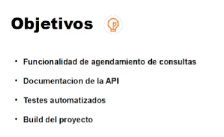
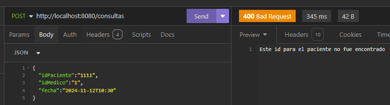
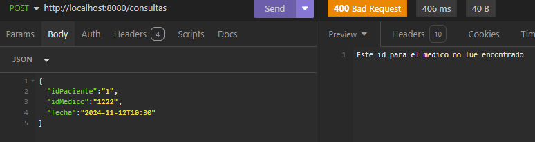

## Curso:
### Instructor:
### Academia: Alura Latam
### Programa: One Next Oracle Education G6: 2024

| Clase | Descripción                                                                                         | Observaciones           |
|-------|-----------------------------------------------------------------------------------------------------|-------------------------|
| 01-04 | Nueva funcionalidad                                                                                 |                         |
|       | se deifinen las nuevas opciones para agendar nueva cita                                             |                         |
|       | se definen las reglas de negocio                                                                    |                         |
|       |                                                                                                     |                         |
| 01-05 | Consulta controller                                                                                 |                         |
|       | Se crea la clase consultacontroller con las siguientes anotaciones:                                 |                         |
|       | @Component, @ResponseBody, @RequestMapping("/consultas")                                            |                         |
|       | se crea el dto DatosAgendarConsulta                                                                 |                         |
|       | se crea el dto DatosDetalleConsulta                                                                 |                         |
|       | se crea la entidad Consulta                                                                         |                         |
|       | se agregan los dto para pacientes                                                                   |                         |
|       | se agregan las migraciones de crear tabla pacientes y tabla consultas                               |                         |
|       |                                                                                                     |                         |
| 01-08 | Clase Service                                                                                       |                         |
|       | se revisan las validaciones basandose en las reglas del negocio                                     |                         |
|       | se corrige errores,                                                                                 |                         |
|       | 1. consultacontroller debia ser marcada con @controller y no con @component                         |                         |
|       | 2. el payload para agregar la consulta era con guiones 2024-10-10                                   |                         |
|       | se crea el service agendadeconsultaservice                                                          |                         |
|       | - se debe respetar el principio de responsabilidad unica                                            |                         |
|       | se separan las las reposnabilidades de cada clase                                                   |                         |
|       | se crea el repositorio                                                                              |                         |
|       |                                                                                                     |                         |
| 01-09 | Validaciones de integridad                                                                          |                         |
|       | se crea la excepcion validaciondeintegridad                                                         |                         |
|       | tambien el metodo seleccionar medico.                                                               |                         |
|       |                                                                                                     |                         |
| 01-11 | Selección medico aleatorio                                                                          |                         |
|       | crear la validaciones con @query                                                                    |                         |
|       |                                                                                                     |                         |
| 02-02 | Clases de validación                                                                                |                         |
|       | se crea el paquete validaciones en consulta                                                         |                         |
|       | se crea la clase HorarioDeFuncionamientoClinica para validar horario                                |                         |
|       | se crea la clase HorarioDeAnticipacion para validar 1/2 hora antes                                  |                         |
|       | se crea la clase PacienteActivo                                                                     |                         |
|       |                                                                                                     |                         |
| 02-03 | Validación                                                                                          |                         |
|       | se crea el metodo en PacienteRepository   findActivoById()                                          |                         |
|       | se crea la validacion PacienteSinConsulta asi como la PacienteActivo                                |                         |
|       | tambien MedicoConConsulta, pacientesinconsulta, medicoactivo                                        |                         |
|       |                                                                                                     |                         |
| 02-04 | Aplicando principios SOLID                                                                          |                         |
|       | como las validaciones tienen metodos y firmas muy similares entonces                                |                         |
|       | se recomienda usar interfaces, se crea ValidadorDeConsultas                                         |                         |
|       | se definen metodos sin cuerpo, y se implementa la interface en todos las validaciones               |                         |
|       | de esa manera se aplica el pilar de polimorfismo                                                    |                         |
|       | se agregan las anotaciones @Component y @Autowired                                                  |                         |
|       | y todas se agregan con List<ValidadorDeConsultas> validadores                                       |                         |
|       | luego aplicando la s de solid se llama: validadores.forEach(validador -> validador.validar(datos)); |                         |
|       |                                                                                                     |                         |
| 02-06 | Testando la agenda                                                                                  |                         |
|       | se procede a ejecutar el programa para revisar errores                                              |  |
|       |                                                                                                     |  |
|       |                                                                                                     |                         |
|       |                                                                                                     |                         |

## Reglas del Negocio

### Agendamiento de consultas

    El sistema debe contar con una funcionalidad que permita agendar citas, en la cual se debe llenar la siguiente información:

    Paciente
    Medico
    Consulta fecha/hora
    Las siguientes reglas de negocio deben ser validadas por el sistema:
    El horario de atención de la clínica es de lunes a sábado, de 07:00 a 19:00 horas;
    Las consultas tienen una duración fija de 1 hora;
    Las consultas deben programarse con al menos 30 minutos de anticipación;
    No permitir agendar citas con pacientes inactivos en el sistema;
    No permitir programar citas con médicos inactivos en el sistema;
    No permita programar más de una consulta en el mismo día para el mismo paciente;
    No permitir programar una cita con un médico que ya tiene otra cita programada en la misma fecha/hora;
    La elección de un médico es opcional, en cuyo caso de que no exista el id el sistema debe elegir aleatoriamente un médico que esté disponible en la fecha/hora ingresada.

### Cancelacion de consultas

    El sistema deberá contar con una funcionalidad que permita la cancelación de consultas, en la cual se deberá diligenciar la siguiente información:

    Consulta
    Motivo de la cancelación
    Las siguientes reglas de negocio deben ser validadas por el sistema:
    Es obligatorio informar el motivo de la cancelación de la consulta, entre las opciones: paciente se retiró, médico canceló u otras;
    Una cita solo se puede cancelar con al menos 24 horas de anticipación.

### Payload para agregar nueva consulta

    {
        "idPaciente":"1",
        "idMedico":"1",
        "fecha":"2024-11-12T10:30"
    }

### Payloads para validaciones de consulta